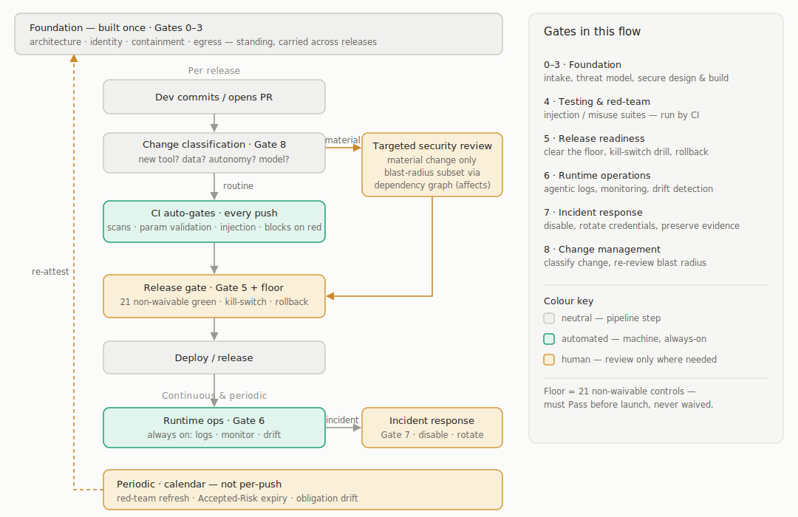

# Agentic AI Security Controls

**A secure-SDLC hardening checklist for agentic AI systems** — 114 security controls spanning the lifecycle (use-case intake → decommissioning), for systems where an AI component can plan, call tools, retrieve context, use memory, communicate with other agents, influence human decisions, or take actions with partial autonomy (including agents that drive or gate cyber-physical systems).

**Version 1.1.1** · 2026-06-21 · see [`CHANGELOG.md`](CHANGELOG.md)

This repository is **not** an attempt to replace existing standards and practices — it brings them together and makes them practical to use when building secure agentic AI systems. The controls it offers are deliberately simple, clear, and measurable.

---

## Quick start

1. **Read it:** [`docs/checklist.md`](docs/checklist.md) — the canonical checklist, 114 controls.
2. **Browse it interactively:** open [`app/checklist.html`](app/checklist.html) in any browser (keep its companions — `app/checklist.css`, `app/data.js`, and `app/checklist.js` — alongside it). It runs fully **offline** — no server, no internet, no CDN.
3. **Use it on a system:**
   - Select the **applicability profiles** your system matches (`Core` applies to every agentic system; profiles are additive).
   - Walk the **SDLC gates** (Gate 0 intake → Gate 9 decommissioning).
   - Mark each in-scope control `Pass` / `Fail` / `Partial` / `Not Applicable` / `Accepted Risk`, adding a note / evidence reference per control.
   - In the reader, **Save** your statuses and notes to a JSON file and **Load** them back next session (the file is the record; nothing is stored automatically).
   - Clear the **Non-Waivable Release Floor** before production launch.
   - Store the evidence package and review on the operating cadence.

---

## Files in this repo

| File | What it is |
| --- | --- |
| **`app/data.js`** | **The single source of truth.** Control data + the AGT risk model (`window.CHECKLIST.agt`). Edit here. |
| **`docs/checklist.md`** | The checklist as a readable document (114 controls). Its control tables + dependency graph are generated from `app/data.js`. |
| `app/checklist.html` | Interactive, offline reader (loads `data.js`, `checklist.js`, and `checklist.css`; keep all three beside it). |
| `app/checklist.js` | Reader logic. |
| `app/checklist.css` | Reader styles. |
| `app/README.md` | Developer guide for the app: data model, reader internals, build step, how to extend. |
| `build.js` | `node build.js` — validates `app/data.js`, then regenerates `docs/checklist.md`'s tables (incl. the §10 evidence table) and the `templates/README.md` index from it. |
| **`templates/`** | Fill-in **evidence-package templates** — one guided template per `docs/checklist.md` §10 artifact, plus an index. See [`templates/README.md`](templates/README.md). |
| `docs/release-flow.svg` | Diagram of the release flow (gates, CI auto-gates, change-triggered review, floor, runtime, periodic). Embedded in this README. |
| `docs/build-evidence.md` | Provenance: how the checklist was built and reviewed. |
| `CHANGELOG.md` | Version history ([Keep a Changelog](https://keepachangelog.com) format). |
| `README.md` | This file. |

> **`app/data.js` is the single source of truth** for control data. The HTML reader loads it directly (no build needed). `docs/checklist.md` is the human-readable document — regenerate its control tables and dependency graph from `app/data.js` with `node build.js`. Provenance is in `docs/build-evidence.md`.

---

## The canonical document at a glance

- **114 controls** across **13 control families** / **21 ID prefixes** (one table section per family).
- A **15-row AGT risk model** crosswalked to OWASP taxonomies.
- **21 non-waivable** release-floor controls.
- **167 dependency edges** between controls (acyclic graph).
- **6 applicability profiles**, an **A0–A3 autonomy model**, and **10 SDLC gates** (0–9).
- A per-control **framework crosswalk** (Appendix F): OWASP Agentic / LLM (derived) and MITRE ATLAS (grounded).
- Appendices A–F (source pointers, family source guide, simplification notes, legend, dependency graph, external-framework crosswalk).

---

## Core concepts

### Applicability profiles
Don't apply all 114 controls to every system. Start with **Core**, then add every profile that matches — scope is `Core + the union of matching profiles`.

| Profile | Use when | Adds families |
| --- | --- | --- |
| Core | Any agentic system (planning, untrusted input, or consequential output) | GOV, ARCH, PROMPT, OUT, DATA, ID, OPS, RES, HITL, SUP, TEST, CHG, IR, DEC |
| Tool-Using | The agent calls tools/APIs/MCP with side effects | TOOL (+ CODE if it can execute code) |
| RAG / Memory | Retrieval or persistent/shared memory | RAG, MEM |
| Multi-Agent | Subagents, delegation, A2A/MCP orchestration | A2A |
| Regulated | Legal, contractual, residency, or attestation obligations | COMP |
| Cyber-Physical | Actuates/gates physical, OT/ICS, robotics, medical, vehicle systems | CPS |

### SDLC gates
Ten gates define **when** control families must be considered across the lifecycle: 0 Use-Case Intake · 1 Architecture & Threat Modeling · 2 Secure Design · 3 Secure Implementation · 4 Security Testing & Red Teaming · 5 Release Readiness · 6 Runtime Operations · 7 Incident Response · 8 Change Management · 9 Decommissioning.

### Release flow
The gates are **not** a per-push checklist a human re-walks on every release — controls run at different cadences. Most are **built once and stand** (architecture, identity, containment); the deterministic ones run as **CI gates on every push**; runtime controls run **continuously**; and a person only re-reviews the **blast radius of a *material* change** (new tool, data source, model, or autonomy bump) — found via the dependency graph (`affects`). The release gate then just confirms the 21-control **floor** is green. The diagram maps that flow onto the gates:

Colour key: **neutral** = pipeline step · **teal** = automated (machine, always-on) · **amber** = human review (only where needed).

### Status values
`Pass` (done, evidence exists) · `Fail` (missing/broken) · `Partial` (gaps remain) · `Not Applicable` (record a reason) · `Accepted Risk` (time-bound waiver with owner, expiry, compensating control, remediation ticket).

### The floor (Non-Waivable Release Floor)
The 21 controls that **must** be cleared before production launch. They **cannot** be marked `Accepted Risk` — only `Pass`, or `Not Applicable` with recorded justification for conditional controls (e.g. cyber-physical). Everything else is waivable through the accepted-risk process; the floor is not.

### Autonomy model
Classify each agent once and reuse it across intake, design, testing, and approvals: **A0** advisory · **A1** assisted action · **A2** supervised delegation · **A3** autonomous operation. High-impact, irreversible, regulated, or safety-relevant actions should not be A3 without explicit risk acceptance and strong compensating controls.

### Risk model and OWASP mapping
Controls map to **`AGT-01`–`AGT-15`**, local risk-family IDs for this document. These are crosswalked (Section 4) to the official **OWASP Agentic** taxonomy (`T1`–`T17`) and the **OWASP LLM Top 10 2025** (`LLM01`–`LLM10`). The `ASI01`–`ASI10` naming used by one source is a community ranking, **not** a canonical OWASP identifier — it is reconciled through the crosswalk. **Appendix F** carries the per-control crosswalk to OWASP Agentic / LLM and MITRE ATLAS. (NIST AI RMF, ISO/IEC 42001, CSA AICM, and AIVSS are deliberately not carried as empty placeholders — an accurate standard mapping is a separate effort.)

### Dependency graph (depends-on / affects)
Each control records:
- **Depends on** — prerequisite controls that must be in place first for it to function or pass.
- **Affects** — the inverse (controls that rely on it).

The graph is **acyclic** with 167 edges. The most load-bearing controls (highest fan-out) are `OPS-01` (logging), `DATA-01` (data classification), `ARCH-02` (untrusted-input map), and `TOOL-01` (tool inventory) — failing one cascades widely. The 14 foundational "do-first" controls have no prerequisites. The full table is **Appendix E**; the HTML reader can sort controls in **step order** (topological): step 1 = no prerequisites, each later step depends only on earlier ones.

---

## The interactive HTML reader

Open `app/checklist.html` directly in a browser. Features:

- **Profile filter** — toggle the profiles your system has; counts update live.
- **Search** — filter by control text, pass criteria, or evidence.
- **Floor only** — show just the 21 non-waivable controls (the launch gate).
- **Click a control** — expand to see pass criteria, evidence, AGT risk, dependency links, and the external-framework crosswalk (OWASP Agentic / LLM, MITRE ATLAS, sources).
- **Status marking** — click the status pill to cycle Pass / Fail / Partial / N/A.
- **Per-control note** — expand a control to add a free-text note / evidence reference.
- **Save / Load** — export your statuses and notes to a JSON file and load them back later. The file is the system of record; the app stores nothing automatically (an `● unsaved` marker and a close-tab prompt guard against losing work). The assessment file is separate from `app/data.js`, which stays the control template.
- **Excel export** — download the current filtered view as a styled `.xlsx` workbook with frozen headers, autofilter, status dropdowns, and automatic highlights for floor controls plus filled statuses/notes.
- **Depends-on / affects chips** — clickable; jump to the related control.
- **Step order toggle** — re-sort the whole list into implementation order (topological). **On by default**; toggle off to group by control family instead.
- **Legend** — collapsible glossary of every ID prefix, tag, and acronym; plus hover tooltips on AGT / floor / profile tags.
- **Light / dark mode** — follows the OS setting. Fully offline (zero CDN/network requests); styles live in the companion `app/checklist.css`.

The reader loads `app/data.js` directly — **`app/data.js` is the source of truth** for control data (the reader derives `affects` and step-order from `dependsOn` at load). `docs/checklist.md`'s control tables and dependency graph are regenerated from the same `app/data.js` with `node build.js`.

---

## Evidence-package templates

Section 10 of the checklist defines a per-release **evidence package** — the artifacts (intake record, threat model, tool inventory, AIBOM, kill-switch drill, decommissioning playbook, …) that demonstrate the controls are satisfied. The [`templates/`](templates/) directory ships a **guided, fill-in template for each** of those 23 artifacts: a header block naming the controls and gate it backs, fill-in `_placeholders_`, and guidance you delete as you complete it.

- Copy a template, fill it in, delete the guidance, and store it as evidence; assemble the full set at **Gate 5 (Release Readiness)**.
- The interactive reader surfaces the relevant template(s) in each control's expanded row ("Evidence templates").
- The artifact list is part of the single source of truth (`app/data.js` → `window.CHECKLIST.templates`); `docs/checklist.md` §10 and [`templates/README.md`](templates/README.md) are generated from it by `node build.js`.

See [`templates/README.md`](templates/README.md) for the index and the per-artifact control mapping.

---

## How it was made

**Source.** A NotebookLM project, `AI security`, containing five authoritative sources:

- *Agentic AI Red Teaming Guide* (2025) — Cloud Security Alliance + OWASP
- *OWASP Top 10 for Agentic Applications* (2026)
- *Prompt Injection Taxonomy* (poster by CrowdStrike)
- *Securing AI Agents: Foundations, Frameworks, and Real-World Deployment*
- *Securing AI Systems: A Playbook for Security Leaders*

**Process.** Two agents produced independent checklists — a source-grounded controls catalog (Claude) and a governance/SDLC skeleton (Codex). A blind, multi-reviewer comparison found the skeleton stronger on structure and the catalog stronger on coverage, so they were merged into a unified document (229 controls), then simplified (Codex) into a usable ~101-control baseline. A coverage analysis found the simplification had dropped 13 distinct controls, which were reinstated to produce **Canonical v1.0 (114 controls)**. A dependency graph and legend were added last. Full detail and the blind-review verdict are in `docs/build-evidence.md`.

Public OWASP references checked on 2026-06-19:

- OWASP GenAI Security Project — *Agentic AI: Threats and Mitigations* (v1.1, Dec 2025): https://genai.owasp.org/resource/agentic-ai-threats-and-mitigations/
- OWASP GenAI Security Project — *2025 Top 10 for LLMs and Gen AI Apps*: https://genai.owasp.org/llm-top-10/
- OWASP GenAI Security Project — *Securing Agentic Applications Guide 1.0* (Jul 2025): https://genai.owasp.org/resource/securing-agentic-applications-guide-1-0/

---

## Versioning

Released under [semantic versioning](https://semver.org), keyed to the **control set** — saved assessments reference control IDs, so changes to IDs are the compatibility boundary:

- **MAJOR** (`x.0.0`) — controls added, removed, or renumbered; family / ID-scheme changes. Saved assessments may need remapping.
- **MINOR** (`1.x.0`) — control wording, pass criteria, or evidence refined; new appendices; reader / tooling features. Existing control IDs stay stable.
- **PATCH** (`1.0.x`) — editorial fixes, typos, non-semantic corrections.

Current release: **1.1.1** — see [`CHANGELOG.md`](CHANGELOG.md). The checklist document edition is labelled *Canonical v1.0* (in `docs/checklist.md`); control IDs are unchanged since 1.0.0.

---

## Caveats

- **Local IDs.** `AGT-*` (and the source's `ASI*`) are not official OWASP identifiers; use the Section 4 crosswalk.
