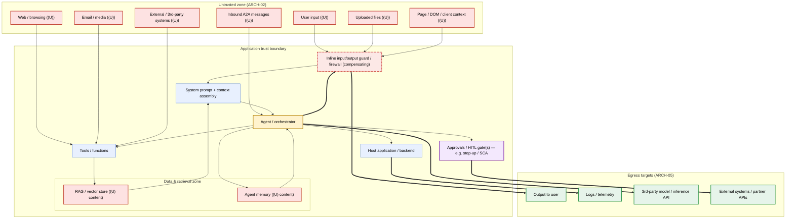

# Agent Data-Flow Diagram

> **Evidence-package template** — Agentic AI Security Controls checklist (see `docs/checklist.md` §10).
> **Backs controls:** ARCH-01, ARCH-02, ARCH-05
> **SDLC gate:** 1 — Architecture & Threat Modeling  ·  **Family:** Architecture
> Copy this file, fill every _placeholder_, and delete the guidance blockquotes (lines starting with ">") before it becomes evidence.

**System / agent:** _<name>_  ·  **Owner:** _<name, role>_  ·  **Date:** _<YYYY-MM-DD>_  ·  **Version:** _<vN>_  ·  **Status:** _Draft / Reviewed / Approved_

---

> **What this artifact proves.** A current, accurate data-flow diagram for the agentic system. It is the primary evidence for **ARCH-01** (maintain a data-flow diagram), **ARCH-02** (untrusted inputs are visibly marked), and **ARCH-05** (egress paths are explicit and classified). It is the foundation the threat model and most downstream controls depend on, so keep it truthful and keep it current.
>
> **The committed deliverable is the rendered image — `agent-data-flow.png` — exported from the diagram below.** This `.md` file is the editable source; the `.png` is what ships in the per-release evidence package. Regenerate the `.png` whenever the diagram changes and re-export before sign-off.

## 1. Scope and assumptions

> State exactly which system/agent this diagram covers and where the boundary of the diagram sits. A diagram that quietly omits a tool, a memory store, or an egress path is worse than none — it makes the threat model lie. Name what is in scope and, explicitly, what is out of scope and why.

- **In scope:** _<which agent(s), version, environment — e.g. production tenant / customer / user (whichever is the real isolation boundary)>_
- **Isolation boundary:** _<state the real isolation boundary explicitly — tenant / per-customer / per-user — and where it is enforced; single-tenant systems are often still multi-customer, so do not just name the credential audience>_
- **Out of scope (and why):** _<adjacent systems intentionally excluded — note that RAG isolation (RAG-05) may be N/A when the corpus is shared and contains no customer data>_
- **Diagram last reconciled against the running system on:** _<YYYY-MM-DD by whom>_
- **Companion artifacts:** _<link to threat model, egress map / ARCH-05, trust-boundary list / ARCH-02>_

## 2. Starter diagram (edit this)

> Edit the Mermaid skeleton below until it reflects your real system, then export it to `agent-data-flow.png`. Keep every node ARCH-01 requires (Section 3). Wrap each trust zone in a `subgraph` so trust boundaries are visible (ARCH-02). Mark untrusted-input sources and classified egress edges with the conventions shown — do not leave them as plain arrows.
>
> Conventions used below (keep or replace consistently, then describe them in Section 6):
> - `((U))` suffix or red styling = **untrusted input** (ARCH-02) — includes page/DOM/serialized client context
> - `==>` thick arrows = **classified egress path** (ARCH-05)
> - `subgraph` = **trust boundary / zone**
> - dashed-red `guard` node = **inline input/output guard / firewall** (compensating control; record its per-environment enforce/monitor mode in Section 6)
> - purple `approval` node = **approvals / human-in-the-loop gate** (ARCH-01); a high-risk action the agent only drafts routes through here to an out-of-band execution gate
>
> _EXAMPLE node/edge content below is illustrative — replace it with your system and delete this line._

## 3. Required elements checklist

> The diagram is not complete until every box below is checked against the rendered `agent-data-flow.png`. These map directly to ARCH-01/02/05. If an element genuinely does not exist in your system, do not silently omit it — change its `[ ]` to `[N/A]` and record the reason in the Section 6 N/A list (do not delete the item). A2A messages, web/browsing, and email/media are the canonical cleanly-N/A elements for a single-agent, no-browse chatbot.

**Nodes ARCH-01 requires — all present and labeled:**
- [ ] Prompts (system prompt + context assembly)
- [ ] Tools / functions the agent can call
- [ ] Agent memory store(s)
- [ ] RAG / retrieval / vector store(s)
- [ ] Logs / telemetry sinks
- [ ] Users / human actors
- [ ] Agent(s) / orchestrator
- [ ] Host application(s) / backend
- [ ] External / third-party systems
- [ ] Approval / human-in-the-loop gate(s) present and labeled

**Untrusted inputs visibly marked (ARCH-02) — risks AGT-01, AGT-05, AGT-08:**
- [ ] User input marked untrusted
- [ ] Uploaded files marked untrusted
- [ ] Page / DOM / serialized client context marked untrusted (route, selected ids, visible labels)
- [ ] RAG / retrieved content marked untrusted
- [ ] Memory content marked untrusted
- [ ] Web / browsing content marked untrusted
- [ ] Tool output marked untrusted
- [ ] Email / media marked untrusted
- [ ] Inbound agent-to-agent (A2A) messages marked untrusted

**Explicit, classified egress paths (ARCH-05) — risks AGT-04, AGT-06:**
- [ ] Egress to users shown and classified
- [ ] Egress to tools shown and classified
- [ ] Egress to logs shown and classified
- [ ] Egress to external systems shown and classified
- [ ] Egress to third-party / inference models shown and classified

**Structure:**
- [ ] Trust boundaries drawn as subgraphs / zones (untrusted vs. controlled)
- [ ] A legend explains the untrusted / egress / boundary conventions (Section 6)
- [ ] `agent-data-flow.png` is exported from the current diagram and committed

## 4. Untrusted-input register (ARCH-02)

> One row per untrusted-input source in the diagram. This is the trust-boundary list ARCH-02 calls for. "Untrusted" means content an adversary could influence — treat tool output, RAG, and memory as untrusted, not just direct user input. Page / DOM / serialized client context (route, selected ids, visible balances/labels supplied by the front-end) is an attacker-forgeable untrusted channel: treat it as DATA; client-supplied identifiers must be re-authorized server-side and never trusted for authorization (AGT-01, AGT-03). If an inline guard/filter screens an inbound channel, name it in the handling column and record its mode in Section 6.

| Input source | Enters at (node/edge) | Untrusted because | Sanitization / handling at boundary | Related risk |
|---|---|---|---|---|
| _EXAMPLE — delete this row: Uploaded file_ | _PROMPT via FILES_ | _Attacker-controlled document content_ | _Content extraction sandbox + injection screening_ | _AGT-01_ |
| _EXAMPLE — delete this row: Page / DOM / client context_ | _GUARD via PAGECTX_ | _Attacker can forge route / selected ids / visible labels from the front-end_ | _Treated as data; client-supplied identifiers re-authorized server-side, never trusted for authz_ | _AGT-01, AGT-03_ |
| _<source>_ | _<node/edge>_ | _<why untrusted>_ | _<control / link>_ | _<AGT-0x>_ |

## 5. Egress register (ARCH-05)

> One row per egress edge (the thick `==>` arrows). Classify each path by sensitivity of what can leave and the control on it. Unclassified egress is how data exfiltration and unintended actions slip through — this register is the egress map ARCH-05 requires. Where the agent only proposes/drafts a high-risk action and real execution happens out-of-band (e.g. behind step-up auth / SCA in a downstream system), use the **Agent role** column to say so and name where the real execution gate lives — that location is the evidence, not a bare egress edge. A path that deliberately terminates at a draft (real gate downstream, out of agent scope) must read distinctly from one the agent can complete itself.

| Egress path | Destination | Data classification | Control / approval on the path | Agent role (executes / drafts only — real gate) | Related risk |
|---|---|---|---|---|---|
| _EXAMPLE — delete this row: AGENT ==> 3rd-party model_ | _Inference API_ | _Confidential — may contain user data_ | _Output filter + DLP; no secrets in context_ | _Executes_ | _AGT-06_ |
| _EXAMPLE — delete this row: AGENT --> APPROVAL ==> External system_ | _Payments / workflow API_ | _Restricted — high-risk action_ | _Out-of-band approval gate; agent never executes_ | _Drafts only — real gate: step-up auth / SCA in downstream UI_ | _AGT-02_ |
| _<path>_ | _<destination>_ | _<class>_ | _<control / approval>_ | _<executes / drafts only — name the real gate>_ | _<AGT-0x>_ |

## 6. Legend, conventions, and notes

> Spell out the visual conventions a reviewer needs to read the `.png` without this file. Record any element marked N/A from Section 3 with the reason, and note known gaps or assumptions a threat modeler must inherit.

- **Untrusted marking convention:** _<e.g. red fill + ((U)) suffix>_
- **Egress marking convention:** _<e.g. thick green arrows>_
- **Trust-boundary convention:** _<e.g. labeled subgraphs>_
- **Approval / HITL-gate convention:** _<e.g. purple node on the path before high-risk egress>_
- **Inline guard / firewall convention:** _<e.g. dashed-red node on inbound + outbound edges>_
- **Inline guard / firewall layer:** _<record (a) whether an inbound-prompt and/or outbound-response guard is in the path, (b) its enforcement mode per environment (enforce / monitor / off — e.g. enforce in prod, monitor in staging), and (c) whether a guard block/redaction surfaces correctly to the user and to logs. A guard decision the UI renders as success (block-but-UI-shows-success) is a tracked discrepancy, not a pass. The guard is a COMPENSATING control and does not replace server-side authorization. Record as "none" if no inline guard exists.>_
- **Elements marked N/A (with reason):** _<list every Section 3 item changed to [N/A] here with its reason — e.g. A2A / web / email N/A for a single-agent no-browse chatbot — or "none">_
- **Known gaps / assumptions for the threat model:** _<list, or "none">_

## Sign-off

> All listed owners must sign before this diagram counts as Gate 1 evidence. Replace _placeholders_ with real names and dates; record Approved / Rejected / Approved-with-conditions in the Decision column.

| Role | Name | Date | Decision |
|---|---|---|---|
| Security owner (required) | _<name>_ | _<YYYY-MM-DD>_ | _Approved / Rejected / Conditions_ |
| Architecture / engineering owner | _<name>_ | _<YYYY-MM-DD>_ | _Approved / Rejected / Conditions_ |
| Product owner | _<name>_ | _<YYYY-MM-DD>_ | _Approved / Rejected / Conditions_ |
